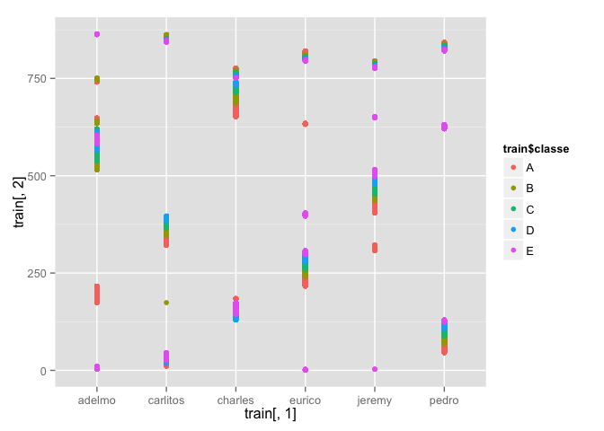

### Obtaining data

Training and test set was downloaded into working directory. Then empty
columns were excluded. Actually it could be done in more elegant way
during loading csv files.

    train <- read.csv("pml-training.csv", stringsAsFactors = FALSE)
    test <- read.csv("pml-testing.csv", stringsAsFactors = FALSE)
    minusCol1 <- colSums(train == "") > 10000
    minusCol1[is.na(minusCol1)]  <- TRUE
    minusCol2 <- colSums(is.na(train)) > 10000
    minusCol <- minusCol1 | minusCol2
    minusCol[c(1, 3:6)] <- TRUE
    train <- train[,!minusCol]

#### Using `user_name` variable

I know some students have opinions that it's not necessary to use ID
variable. I believe different persons can do things in different ways.
That's why I didn't omit this variable. Here's a plot that shows my
motivation. For some users parameters may be significant different.

    library(ggplot2)
    qplot(train[,1], train[,2], colour = train$classe)

### Gradient boosting method

Gradient boosting method showed excellent results but it took pretty
long time to train model (more than 30 minutes). Accuracy on training
set is higher 99%. This model gave 20/20 answers on final test.

    library(caret)
    # fit_gbm <- train(classe ~., data = tr, method = "gbm")
    fit_gbm <- readRDS("gbm01.rds")
    confusionMatrix(predict(fit_gbm, train), train$classe)

    ## Confusion Matrix and Statistics
    ## 
    ##           Reference
    ## Prediction    A    B    C    D    E
    ##          A 5575   28    0    0    0
    ##          B    5 3744   17    7    6
    ##          C    0   25 3399   26    4
    ##          D    0    0    4 3183   29
    ##          E    0    0    2    0 3568
    ## 
    ## Overall Statistics
    ##                                           
    ##                Accuracy : 0.9922          
    ##                  95% CI : (0.9909, 0.9934)
    ##     No Information Rate : 0.2844          
    ##     P-Value [Acc > NIR] : < 2.2e-16       
    ##                                           
    ##                   Kappa : 0.9901          
    ##  Mcnemar's Test P-Value : NA              
    ## 
    ## Statistics by Class:
    ## 
    ##                      Class: A Class: B Class: C Class: D Class: E
    ## Sensitivity            0.9991   0.9860   0.9933   0.9897   0.9892
    ## Specificity            0.9980   0.9978   0.9966   0.9980   0.9999
    ## Pos Pred Value         0.9950   0.9907   0.9841   0.9897   0.9994
    ## Neg Pred Value         0.9996   0.9967   0.9986   0.9980   0.9976
    ## Prevalence             0.2844   0.1935   0.1744   0.1639   0.1838
    ## Detection Rate         0.2841   0.1908   0.1732   0.1622   0.1818
    ## Detection Prevalence   0.2855   0.1926   0.1760   0.1639   0.1819
    ## Balanced Accuracy      0.9986   0.9919   0.9949   0.9939   0.9945

### Random forests

Default settings of training model using random forests causing leads to
long training time. Using cross validation tuning it's possible to
reduce training time. Parameter `number` divides training set on 2 folds
in my case (while default settings have 25 resampling iterations). This
gives 100% accuracy on training set and 20/20 on test set. Training time
was about 6 minutes and it increases by 5-6 minutes with every new fold.

    library(caret)
    # set.seed(19)
    # fit_rf2 <- train(classe ~., 
    #                 method="rf", 
    #                 trControl=trainControl(method = "cv",
    #                                        number = 2), 
    #                 data=train)
    fit_rf2 <- readRDS("fit_rf2.rds")
    confusionMatrix(predict(fit_rf2, train), train$classe)

    ## Loading required package: randomForest
    ## randomForest 4.6-12
    ## Type rfNews() to see new features/changes/bug fixes.

    ## Confusion Matrix and Statistics
    ## 
    ##           Reference
    ## Prediction    A    B    C    D    E
    ##          A 5580    0    0    0    0
    ##          B    0 3797    0    0    0
    ##          C    0    0 3422    0    0
    ##          D    0    0    0 3216    0
    ##          E    0    0    0    0 3607
    ## 
    ## Overall Statistics
    ##                                      
    ##                Accuracy : 1          
    ##                  95% CI : (0.9998, 1)
    ##     No Information Rate : 0.2844     
    ##     P-Value [Acc > NIR] : < 2.2e-16  
    ##                                      
    ##                   Kappa : 1          
    ##  Mcnemar's Test P-Value : NA         
    ## 
    ## Statistics by Class:
    ## 
    ##                      Class: A Class: B Class: C Class: D Class: E
    ## Sensitivity            1.0000   1.0000   1.0000   1.0000   1.0000
    ## Specificity            1.0000   1.0000   1.0000   1.0000   1.0000
    ## Pos Pred Value         1.0000   1.0000   1.0000   1.0000   1.0000
    ## Neg Pred Value         1.0000   1.0000   1.0000   1.0000   1.0000
    ## Prevalence             0.2844   0.1935   0.1744   0.1639   0.1838
    ## Detection Rate         0.2844   0.1935   0.1744   0.1639   0.1838
    ## Detection Prevalence   0.2844   0.1935   0.1744   0.1639   0.1838
    ## Balanced Accuracy      1.0000   1.0000   1.0000   1.0000   1.0000

### Conclusion

Both methods, Gradient Boosting and Random Forests gave excellent
results on training set with accuracy \>99% and 100% respectively. Both
methods passed final test 20/20. Full code and models available on my
repo: <https://github.com/yurkai/PML-CP>

Ps. To my mind this project was controversial. Because I used really
sophisticated and complex methods just with few lines of code without
understanding of inner mechanics of these methods. If you'll say that I
better spend time on it and there are tons of information you will
probably right, that's why took another few courses dedicated machine
and statistical learning. Thanks.
